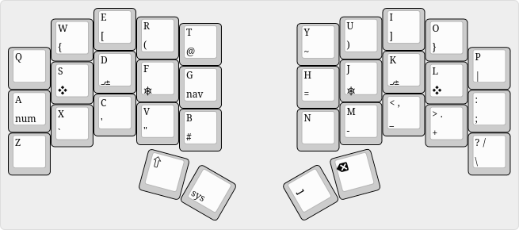
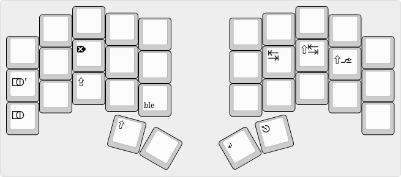
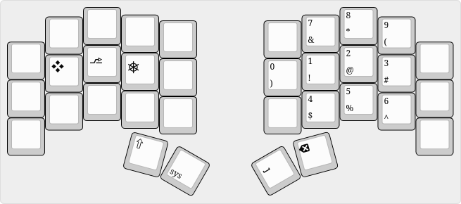
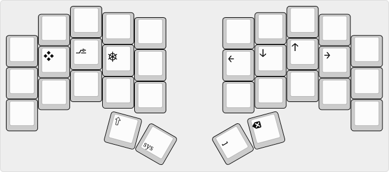
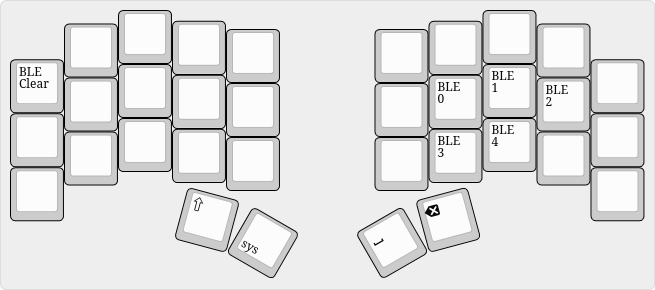

# Sweep XIAO

This is ZMK support for my handwired Sweep Bling MX with Seeeduino XIAO BLE
microcontrollers.

It is quite possible I will make a PCB version one day, but don't count on that.

## Keymap

Top labels are what happens when you press the key,
bottom labels are what happens when you hold the key.

Default layer:

Sys layer:

Number layer:

Nav layer:

BLE layer:

